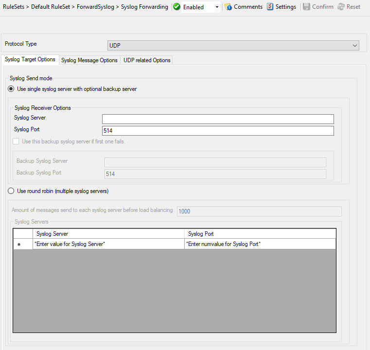

Syslog Support
==============

NT Event Messages can be forwarded using standard Syslog protocol. NT severity
classes are mapped to the corresponding Syslog classes. Codes are fully
supported.

Further details can be found here:
:doc:`syslog forwarding <../shared/a-forwardsyslogoptions>`.
