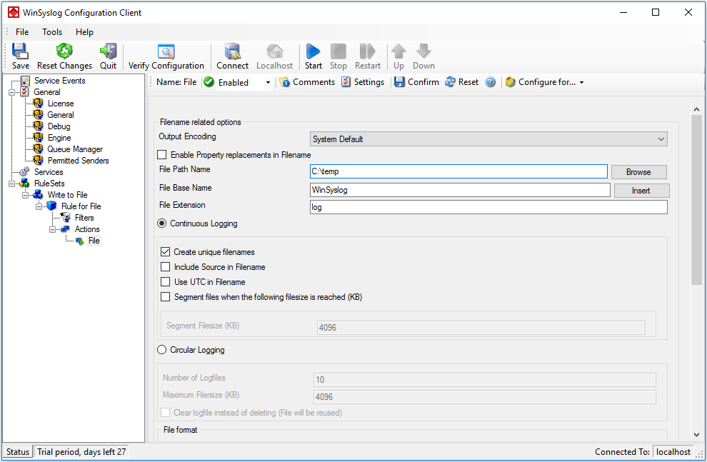

.. _winsyslog-tutorial-write-to-file:

Tutorial: Create a Simple Syslog Server and Write to a File
===========================================================

Use this tutorial when you want WinSyslog to receive syslog messages and store
them in a local text file.

Goal
----

At the end of this procedure, WinSyslog will:

- listen for incoming syslog messages
- pass them through a ruleset
- write matching messages to a file on disk

Prerequisites
-------------

- A writable target directory for log files
- At least one ruleset for incoming messages
- A service that will bind to that ruleset

Steps
-----

1. Create or choose a ruleset.

   - In the WinSyslog Configuration Client, create a ruleset for the messages
     you want to store.
   - If this is your first setup, you can also reuse the ruleset from
     :doc:`Creating an Initial Configuration <creatinganinitialconfiguration>`.

2. Add a **Write to File** action.

   - Inside that ruleset, add a
     :doc:`Write to File <../mwagentspecific/a-fileoptions>` action.
   - Open the file logging settings.

3. Configure the target file.

   - Set **File Path Name** to the directory where WinSyslog should write the
     files.
   - Set **File Base Name** to the logical file name prefix.
   - Keep the default extension unless you need something specific.

4. Decide how files should be created.

   - Use daily unique filenames if you want date-based rotation.
   - Use a continuous filename if another process expects one stable file name.
   - Enable **Include Source in Filename** only if you explicitly want
     separate files per sender.

5. Bind message intake to the ruleset.

   - Ensure at least one service, for example a
     :doc:`Syslog server service <../mwagentspecific/syslogserver>`, is bound
     to the ruleset that contains the file action.

6. Save the configuration and restart the WinSyslog service if required.

Verification
------------

1. Send a test message with **Tools -> Send Syslog Test Message**.
2. Open the configured directory.
3. Confirm that WinSyslog created the expected log file.
4. Open the file with a tool that does not lock it aggressively, such as
   Notepad.

Next step
---------

If file logging works, continue with:

- :doc:`Creating an Initial Configuration <creatinganinitialconfiguration>`
- :doc:`Write to File action reference <../mwagentspecific/a-fileoptions>`
- :doc:`Store and forward <producttour/store-and-forward>`
